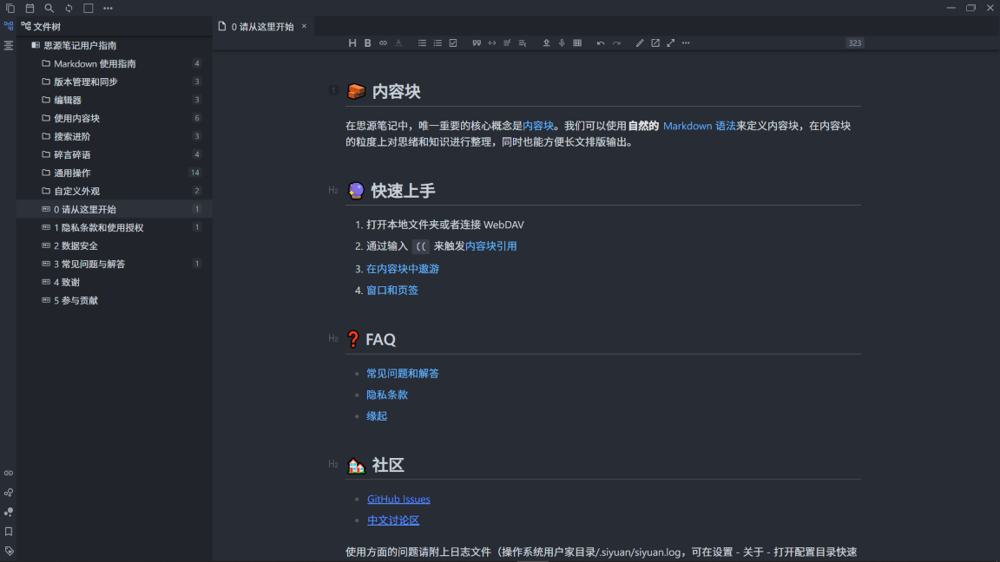

# Siyuan-Simple-OneDark

## 简介

- 参考
  - VS Code的One Dark Pro主题
  - Typora的OneDark主题
  - Mark Text的One Dark主题
- 所做的工作
  - 整体配色更改
  - 样式更改
    - 大纲
    - 表格
    - 复选框
    - 代码块
    - 引用块
    - 引用计数块
  - 其他
    - 公式字号调整
    - 标题块右移

## 历史版本

### 0.2.5

- 参考Mark Text的One Dark主题
  - 更改了引用计数块的样式
  - 更改了代码编辑区的底色
  - 更改了字数计数器的底色
- 参考typora的Onedark主题
  - 修复了大纲样式的语法
  - 更改了复选框的样式
- 标题块右移一定距离
- 调整代码块的行高

### 0.1.8

- 调整工具栏和卡片阴影范围
- 调整公式字号大小
- 调整大纲父子结点距离
- 完善部份注释
- 块引用预览页面卡片添加阴影

### 0.1.3

- 参考typora的Onedark主题
  - 更改了表格的样式
  - 更改了引用块的样式
- 调整了代码编辑区域的背景色
- 给代码块、引用块、表格块添加了阴影

### 0.0.9

- 修复了一二级标题底部横线无法显示的问题

## 预览图

